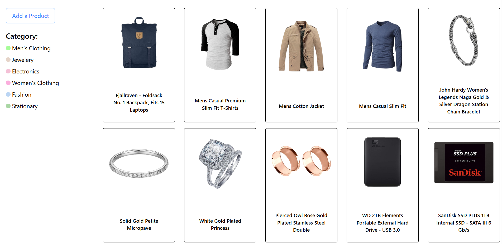
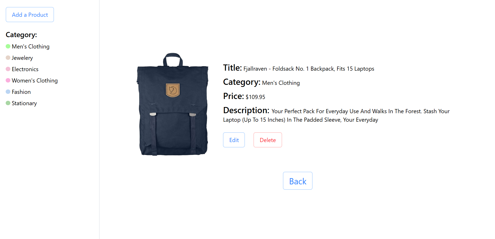
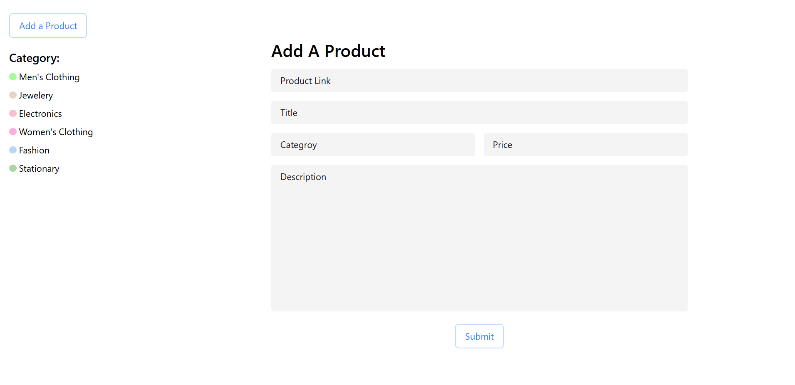
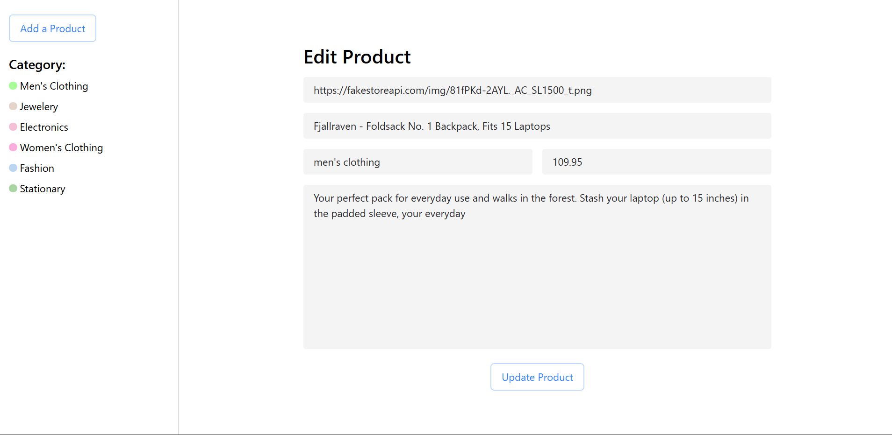

# 🛍️ Store App

A simple React + Vite **product store** where you can:

- Browse products
- Filter by category
- View product details
- Add new products
- Edit & delete existing products

> Built as a practice project to learn React, routing, Context API and basic CRUD flow.

---

## 📸 Screenshots


### Home Page – Product Listing



### Product Details Page



### Add Product Page



### Edit Product Page



---

## ✨ Features

- **Product listing**
  - Shows all products in a clean grid layout.
  - Each card shows product image and title.
- **Category filter**
  - Sidebar with category pills (Men's Clothing, Jewelry, Electronics, etc.).
  - Click a category to see only those products.
- **Product details**
  - Dedicated detail page with image, title, category, price, and description.
  - Buttons to **Edit**, **Delete**, and **Go Back**.
- **Add product**
  - Form to add a new product with:
    - Product image link
    - Title
    - Category
    - Price
    - Description
- **Edit product**
  - Form pre-filled with existing data.
  - Update and save changes.
- **Delete product**
  - Remove a product from the list.
- **Global state with Context API**
  - Products (and possibly selected category) are stored in React Context and shared across components.
- **API layer**
  - Separate Axios utility to handle API calls (fetch, add, update, delete products).

---

## 🧱 Tech Stack

- **Frontend:** React (with Vite)
- **Routing:** React Router
- **State Management:** React Context API
- **HTTP Client:** Axios
- **Styling:** CSS (tailwind)  

---

## 📂 Project Structure

```bash
Store-App/
├─ public/
│  ├─ addProductPage.png
│  ├─ editProductPage.png
│  ├─ homePage.png
│  ├─ productDetailPage.png
│  └─ vite.svg
├─ src/
│  ├─ assets/
│  │  └─ react.svg
│  ├─ components/
│  │  ├─ AddProduct.jsx
│  │  ├─ Category.jsx
│  │  ├─ Details.jsx
│  │  ├─ EditProduct.jsx
│  │  ├─ Loader.jsx
│  │  ├─ Navbar.jsx
│  │  └─ ProductCard.jsx
│  ├─ utils/
│  │  ├─ Axios.jsx
│  │  ├─ Context.jsx
│  │  └─ Routing.jsx
│  ├─ App.css
│  ├─ App.jsx
│  └─ main.jsx
├─ package.json
└─ README.md